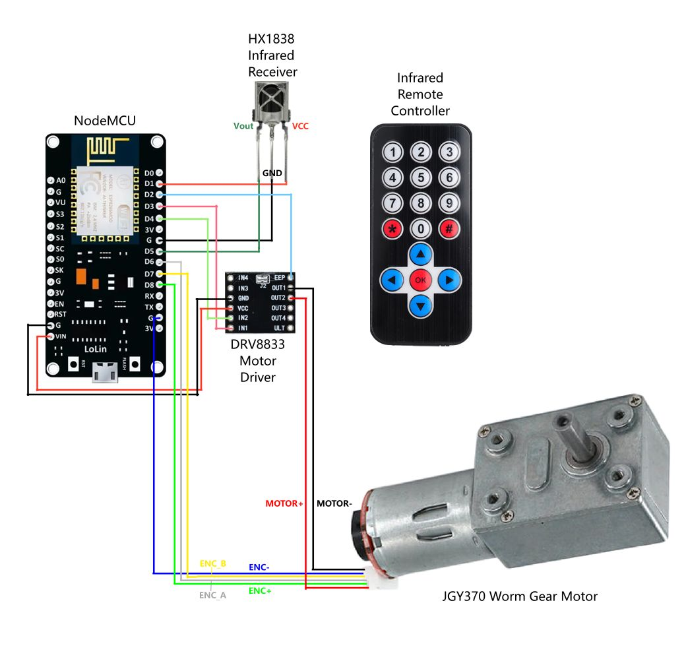
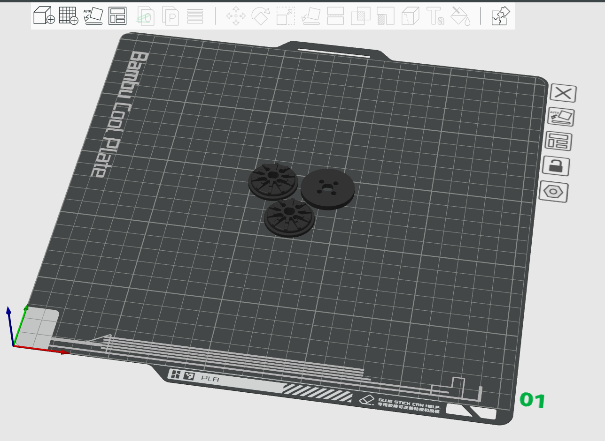

# 混沌猫升窗器

本项目实现了基于 ESP8266 MCU 的百叶窗升窗器，允许用户通过通用红外遥控器手工控制或通过 HomeAssistant 网关远程遥控百叶窗开闭。和市面上现有商品相比，本项目有如下好处：

* 成本低：零部件采购加上 3D 打印的外壳总成本低于 50 RMB，是市售商品的 1/4~1/5

* 完全开放：电路、代码及外壳 CAD 模型全开源，零部件都能在市面上采购到，可任意修改添加新功能

* 教育性强：结构简单，适合亲子动手 DIY

## 硬件结构

组件列表：

* **主控板**：`NodeMCU Lolin V3`（或其他引脚功能兼容的同尺寸开发板）

* **电机驱动**：`DRV8833` 模块

* **红外接收器**：`HX1838`

* **直流电机**：带霍尔编码器的 370 单轴蜗轮蜗杆减速电机（最好是金属齿轮）

接线图如下所示：

## 编译上传固件

在 Visual Studio Code 中：

1. 安装 PlatformIO IDE 插件

2. 打开仓库目录，默认为 USB 串口上传，如需使用 ArduinoOTA 无线上传请修改 platformio.ini 解开相关设置前的注释

3. 使用 PlatformIO 的 Upload 命令（默认快捷键 `Ctrl+Alt+U`）编译上传固件代码

## 外壳制作

FDM 3D 打印时参考切片参数：

* 层高：0.12mm

* 墙层数：6

* 稀疏填充密度：25%

### 拉珠牵引轮

在切片软件中打开  文件，将其拆分为对象并自动布局后打印，最后将用 4 枚 **M3x12** 的螺丝将上下两半牵引轮固定在一起。若需要增加垫块，则上下两半牵引轮和垫块需要用 4 枚 **M3x16** 的螺丝固定。

切片软件中的参考布局如下：

#### 升窗器外壳

在切片软件中打开  文件，将其拆分为对象并自动布局后打印。注意其中的锁紧片要侧向放置，并增加 **5mm 的 Brim** 以稳定打印。打印完毕后锁紧片需要和滑片用万能胶粘合在一起组成完整的背板固定片。

切片软件中的参考布局如下：

## 组装

1. 组装前先按接线图将各个部件用杜邦线连接好，测试功能正常后再拆线继续组装

2. 将 NodeMCU 板用 4 枚 **M3x4** 的沉头自攻螺丝背面朝上固定在外壳内，MicroUSB 口卡在底部的长方形开孔中

3. 用热熔胶将 DRV8833 模块固定在 NodeMCU 背面靠近 MicroUSB 口的位置

4. 用 4 枚 **M3x6** 的沉头螺丝将减速电机固定在外壳上

5. 按照接线图用杜邦线连接各个部件，并用塑料扎带将其捆好塞在外壳中（注意不要影响到减速电机的编码器磁环旋转！）

6. 用 4 枚 **M3x12** 的沉头自攻螺丝将背板固定在外壳上

7. 将拉珠牵引轮安装到电机轴上，挂上百叶窗拉珠后寻找合适的安装位置和角度，确保拉珠绷紧不缠绕且升窗器可以自由滑入滑出背板固定片，对合适的位置角度进行标记

8. 用膨胀螺丝或 3M 厚双面胶将背板固定片固定在标记位置处，拉珠套在升窗器牵引轮上，同时将升窗器插入背板固定片固定好

9. 从 MicroUSB 口接入 **5~7.2V** 的外接 DC 电源，电压越高窗帘升降速度越快

## 配置与使用

1. **网络配置**：初次上电后等待 5s，用手机搜索形如 `ESP-xxxxxx` 的热点并连接，会自动跳出无线和 MQTT 配置界面，填写无线 SSID 和密码、MQTT 服务地址、端口、登录用户名和密码即可保存关闭。此时升窗器将自动连接你的无线热点及对应的 HomeAssistant 服务（以下简称 HA）。
   * 其中 MQTT 相关参数取决于你的 HA 服务配置，具体怎么在内网配置 HA 服务及让外部设备通过 MQTT 访问 HA 服务请自行上网搜索。

2. **行程校准**：遥控器左右键可以强制控制电机运动，正常情况下是左键升起右键放下，按 `OK` 键电机停止。若运动方向相反则可顺序按遥控器的 `0`、`#` 两个键设置电机反向运动。控制电机让百叶窗到完全打开的位置，顺序按 `0`、`1` 两个键保存完全打开位置，然后让百叶窗到完全关闭的位置，顺序按 `0`、`3` 两个键保存完全关闭位置，行程校准就完成了。如有特殊需要，可以顺序按 `0`、`2` 两个键清除已标定的行程并重置当前电机位置为初始位置。

3. **使用方法**： 
   * 遥控器上键：百叶窗完全打开
   * 遥控器下键：百叶窗完全关闭
   * 遥控器 `OK` 键：停止电机
   * HA 服务连接成功后可以在 Web 或手机 App 中进行相同的控制，也可以在 HA 中用自动化规则进行定时开关百叶窗

## 鸣谢

* [Parametric pulley generator for Aqara roller shade driver e1 by 2by2 - Thingiverse](https://www.thingiverse.com/thing:6116520)
