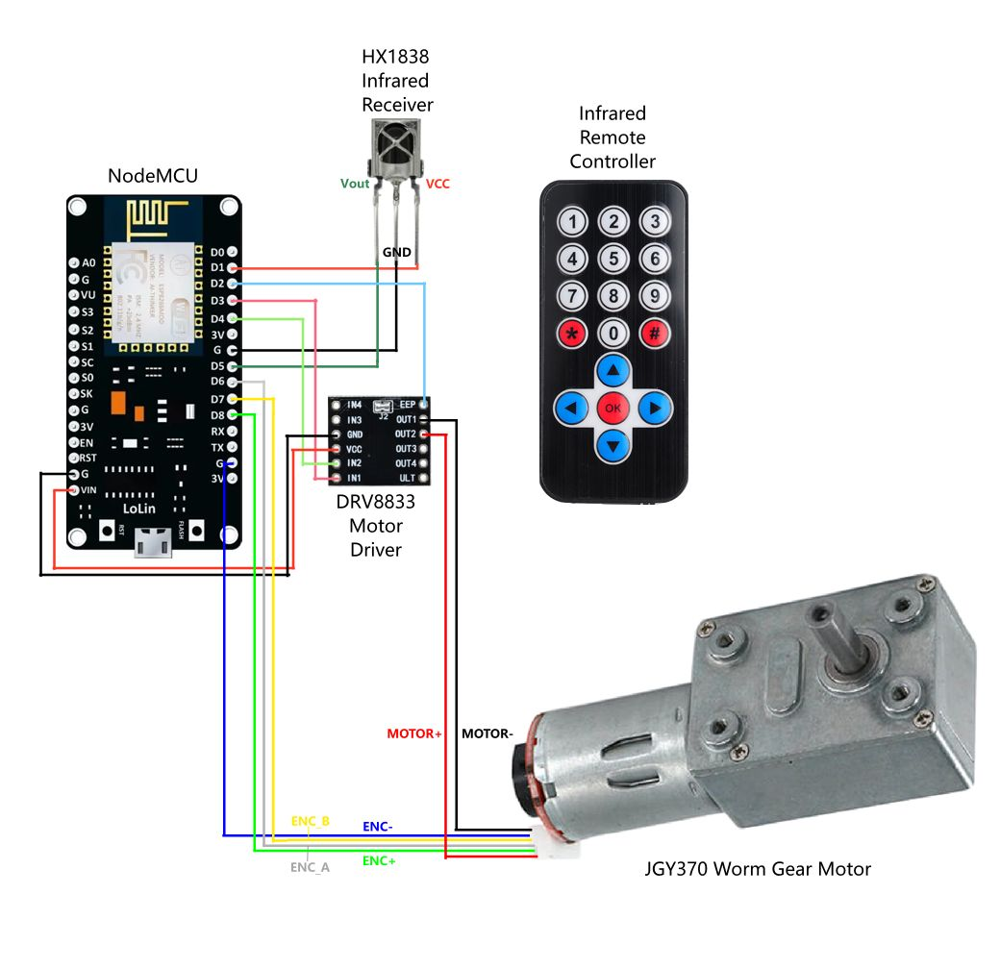
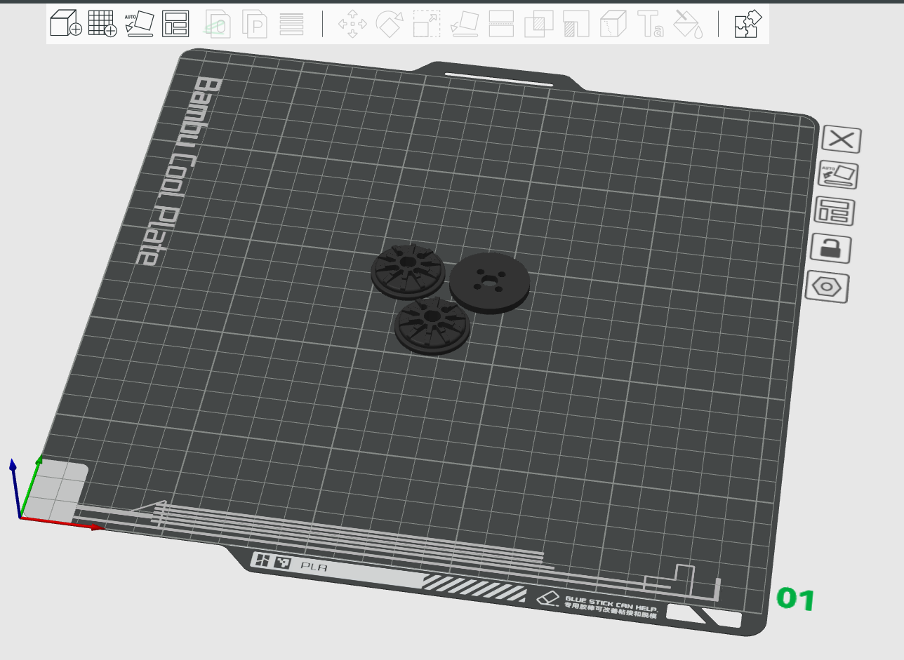
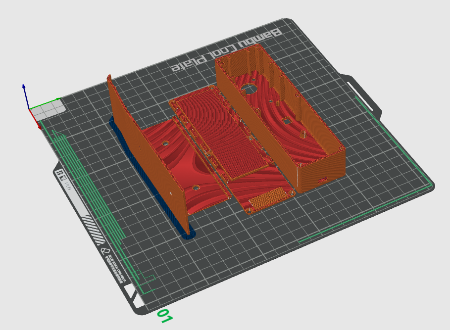
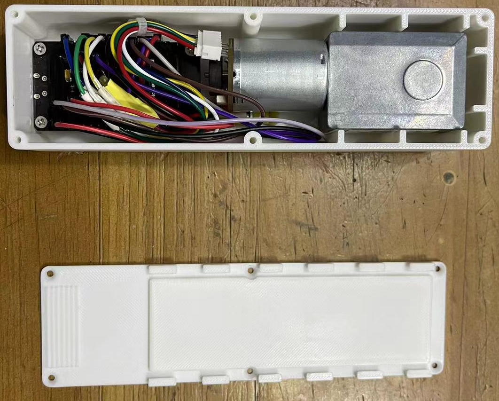

# Chaos Blinds Motor

English | [中文](README-zh.md)

## Introduction

This project implements a blinds motor based on ESP8266 MCU, allowing users to manually control the blinds opening and closing using a universal infrared remote control or remotely via the HomeAssistant gateway. Compared to existing products on the market, this project has the following benefits:

* Low cost: The total cost of components plus the 3D-printed casing is less than 50 RMB, which is 1/4 to 1/5 of the price of commercial products.

* Completely open: The circuit, code, and casing models are all open source, and components can be purchased on the market. Users can freely modify and add new functions.

* Educational: The structure is simple, suitable for hands-on DIY activities with children.

## Hardware Structure

Component list:

* **Main control board**: `NodeMCU Lolin V3` (or other development boards of the same size with pin function compatibility)

* **Motor driver**: `DRV8833` module

* **Infrared receiver**: `HX1838`

* **DC motor**: Single-axis worm gear reduction motor with Hall encoder (preferably with metal gears)

The wiring diagram is as follows:

## Firmware Compilation and Upload

In Visual Studio Code:

1. Install the PlatformIO IDE plugin.

2. Open the repository directory. By default, it uploads via USB serial. If you want to use ArduinoOTA wireless upload, uncomment the relevant settings in `platformio.ini`.

3. Use the PlatformIO Upload command (default shortcut `Ctrl+Alt+U`) to compile and upload the firmware code.

## Make outer casing

When using FDM 3D printing, consider the following slicing parameters:

* Layer height: 0.12mm

* Number of walls: 6

* Sparse infill density: 25%

### Ball Chain Pulley

Open the  file in your slicing software, split it into objects, and automatically arrange them for printing. Finally, use 4 **M3x12** screws to fix the upper and lower halves of the pulley together. If you need to add spacers, use 4 **M3x16** screws to fix the upper and lower halves of the pulley and the spacers together.

The reference layout in the slicing software is as follows:

#### Blinds Motor Casing

Open the  file in your slicing software, split it into objects, and automatically arrange them for printing. Note that the locking pieces should be placed sideways and add a **5mm brim** to stabilize printing. After printing, glue the locking pieces and sliders together with glue to form a complete back plate fixing piece.

The reference layout in the slicing software is as follows:

## Assembly

1. Before assembly, connect various components with DuPont wires according to the wiring diagram. Test the functionality before disassembling and continuing with the assembly.

2. Secure the NodeMCU board with 4 **M3x4** countersunk self-tapping screws, with the back facing up, inside the casing. The MicroUSB port should fit into the rectangular opening at the bottom.

3. Use hot glue to secure the DRV8833 module to the back of the NodeMCU near the MicroUSB port.

4. Use 4 **M3x6** countersunk screws to secure the reduction motor to the casing.

5. Connect various components with DuPont wires according to the wiring diagram and bundle them with plastic zip ties, making sure not to obstruct the rotation of the magnet ring of the Hall encoder.

6. Use 4 **M3x12** countersunk self-tapping screws to secure the back plate to the casing.

7. Install the ball chain pulley onto the motor shaft and hang the blinds ball chain. Find the appropriate installation position and angle to ensure that the chain is tensioned without entanglement and the blinds motor can slide freely into and out of the back plate fixing piece. Mark the appropriate position and angle.

8. Secure the back plate fixing piece at the marked position using expansion screws or 3M double-sided tape. Slip the ball chain onto the blinds motor pulley and insert the blinds motor into the back plate fixing piece.

9. Connect a **5~7.2V** external DC power supply to the MicroUSB port. The higher the voltage, the faster the blinds will rise and fall.

## Configuration and Usage

1. **Network Configuration**: After the first power-up, wait for 5 seconds. Search for the hotspot named `ESP-xxxxxx` on your phone and connect to it. The wireless and MQTT configuration interface will automatically pop up. Fill in the wireless SSID and password, MQTT service address, port, login username, and password, and then save and close. At this point, the blinds motor will automatically connect to your wireless hotspot and the corresponding HomeAssistant (HA) service.

   * The MQTT-related parameters depend on your HA service configuration. Please search online for how to configure the HA service in the local network and allow external devices to access the HA service through MQTT.

2. **Travel Calibration**: The left and right buttons on the remote control can forcibly control the motor movement. Normally, the left button raises and the right button lowers the blinds. Press the `OK` button to stop the motor. If the movement direction is reversed, sequentially press the `0` and `#` buttons on the remote control to set the motor to reverse movement. Control the motor to move the blinds to the fully open position. Press the `0` and `1` buttons sequentially to save the fully open position. Then move the blinds to the fully closed position. Press the `0` and `3` buttons sequentially to save the fully closed position. The travel calibration is now complete. If necessary, press the `0` and `2` buttons sequentially to clear the calibrated travel and reset the current motor position to the initial position.

3. **Usage**:
   * Remote control up button: Fully open the blinds.
   * Remote control down button: Fully close the blinds.
   * Remote control `OK` button: Stop the motor.
   * After successfully connecting to the HA service, you can control it through the web or mobile app in the same way. You can also use automation rules in HA for scheduled blinds opening and closing.

## Acknowledgments

* [Parametric pulley generator for Aqara roller shade driver e1 by 2by2 - Thingiverse](https://www.thingiverse.com/thing:6116520)
